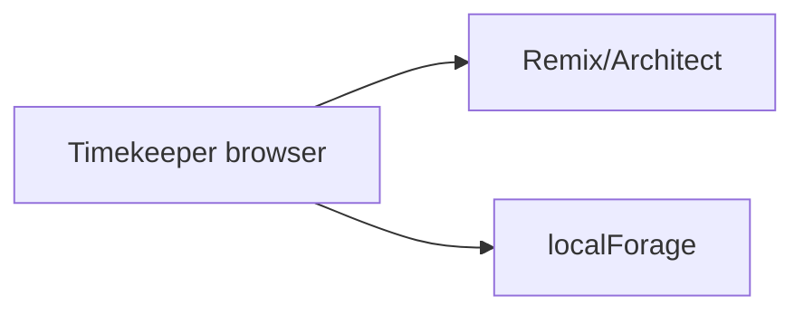

# Current architecture

Authoritative current-state detail lives in [`../current-state/technical-architecture.md`](../current-state/technical-architecture.md).

## Summary

Client-centric Remix application on Architect/AWS. Domain state lives in the browser (localForage). Server primarily delivers the web app.

## Constraints inherited from current architecture

- Changing to multi-tenant server data is a **product + data model** change, not a config flag
- Timing correctness today depends on one device clock and in-memory React state + periodic autosave
- `/admin` and lack of auth are acceptable only while data is device-local and non-commercial
