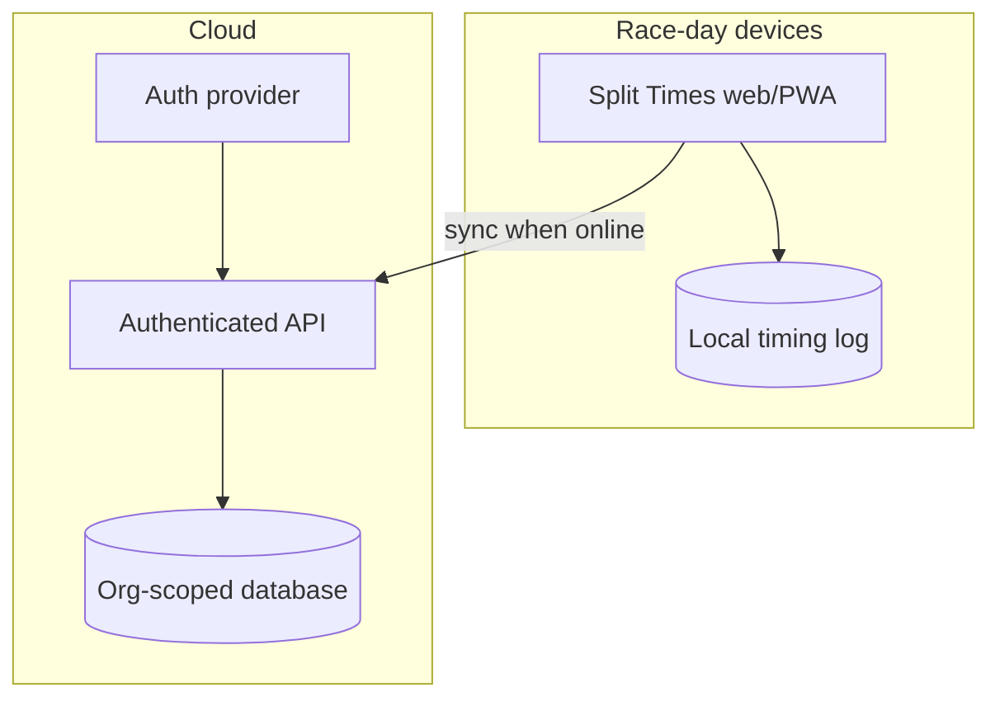

# Target architecture

**Status:** Proposed — not implemented.

## Goals

1. Organisation-scoped durable race storage
2. Preserve excellent single-device race-day UX (local-first capture)
3. Incremental migration from current app — no big-bang rewrite
4. Clear path to multi-device timing later

## Proposed high-level shape

## Suggested components (Proposed)

| Component | Role |
| --- | --- |
| Existing Remix UI | Evolve; extract domain timing functions |
| Auth | Magic link or OAuth for club users |
| API | Race CRUD, timing event ingest, export |
| Database | Postgres (or similar) with org_id on all tenant rows |
| Local timing log | Append-only events for reliability / offline |
| Optional queue | Soften sync bursts |

## Explicit non-choices (for now)

- Not rebuilding as native iOS/Android first
- Not requiring chip hardware
- Not microservices for their own sake

## Decision references

- ADR-001 Multi-tenancy
- ADR-002 Offline / multi-device timing
- ADR-003 Timing data integrity
