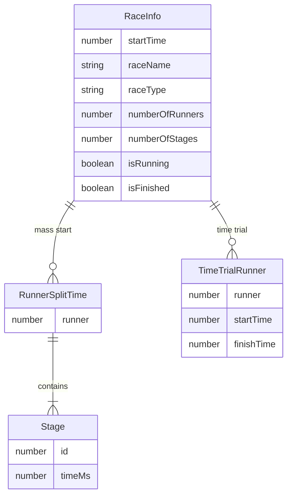

# Domain model

Only concepts that are **present in the current application** or **clearly required** for the stated commercial direction are included. Each is labelled.

---

## Confirmed concepts (implemented)

### Race

A timing session with metadata and timing records.

**Current fields (`RaceInfo`):**

| Field | Meaning |
| --- | --- |
| `startTime` | Epoch ms when the mass-start clock started (also used as storage key) |
| `currentTime` | Latest clock sample (epoch ms) |
| `isRunning` | Whether the race clock / session is active |
| `isFinished` | Whether the race was finished |
| `numberOfRunners` | Count of bibs `1..N` |
| `numberOfStages` | Number of sequential stages (mass start only) |
| `raceDate` | Locale date string at setup |
| `raceName?` | Optional display name |
| `raceType` | `"massStart"` \| `"timeTrial"` |

Evidence: `app/types.ts`, `app/routes/_index.tsx`.

### Race type

- **Mass start** — shared timer; each runner accumulates stage split durations.
- **Time trial** — each runner has independent `startTime` / `finishTime`.

### Runner (bib)

**Confirmed:** An integer bib number from `1` to `numberOfRunners`. Not a person entity. No name, club, category, or contact details.

### Stage

**Confirmed (mass start):** Ordered split segment `id: 1..numberOfStages` with a duration `time` in milliseconds.

**Important:** Stage `time` values are **segment durations** (lap/split increments), not cumulative clock times. Total time = sum of stage times.

### Runner split times

**Confirmed:** `RunnerSplitTime { runner, stage: Stage[] }` for mass start.

### Time trial runner

**Confirmed:** `TimeTrialRunner { runner, startTime, finishTime }` absolute epoch timestamps. Elapsed = `finishTime - startTime` when finished.

### UI mode

**Confirmed (mass start only):** `"buttons"` | `"keypad"` — input interaction pattern, not a domain entity stored with race results (not persisted as part of saved race metadata beyond in-memory session).

### Past race record

**Confirmed:** localForage entry keyed by race `startTime` (stringified) or, for some TT cases, `tt-${raceDate}`.

Payload shape:

```ts
{
  splitTimes?: RunnerSplitTime[];
  timeTrialRunners?: TimeTrialRunner[];
  raceInfo: RaceInfo;
}
```

---

## Concepts not present (but often expected in this domain)

| Concept | Status | Notes |
| --- | --- | --- |
| Organisation / Club | **Missing** | Required for commercial multi-tenancy |
| Event (multi-race container) | **Missing** | “Race” is the top-level unit today |
| Athlete / Participant profile | **Missing** | Only bib numbers |
| Team | **Missing** | |
| Timing point | **Missing** as named entity | Stages are anonymous numbered segments |
| Timing record (append-only audit) | **Missing** | Current model mutates stage times / TT fields |
| Official result / ranking entity | **Partial** | Rankings computed in UI sort only |
| Category / gender / age group | **Missing** | |
| Membership | **Missing** | |
| Timekeeper / Volunteer account | **Missing** | |
| Course | **Missing** | |

---

## Conceptual relationships (current)



---

## Timing semantics (critical)

1. Mass-start stage times are **incremental durations**.
2. Mass-start total = Σ stage times.
3. Time-trial elapsed = finish − start (absolute device clock).
4. Missing/unrecorded mass-start stages remain `0` and display as `00:00:00.0`.
5. Unfinished TT runners display as **DNF** on results when sorted/shown with `elapsed === 0`.

See [`business-rules.md`](business-rules.md).
