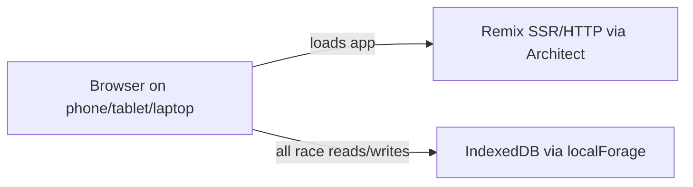

# Application overview (current state)

**Scope:** What exists today in [daryl-sf/split-times](https://github.com/daryl-sf/split-times). No target-state content.

## One-sentence summary

Split Times is a Remix web app that lets a timekeeper configure a mass-start or time-trial session, record times on one browser device, and review/copy results stored in that device’s IndexedDB.

## Routes

| Route | Purpose | Status |
| --- | --- | --- |
| `/` | Race setup + live timing UI | Confirmed — primary surface |
| `/races` | List/delete past races from local storage | Confirmed |
| `/race/:id` | View saved race results | Confirmed |
| `/admin` | Clear local DB | Confirmed — unprotected |

## Major capabilities

1. Mass-start multi-stage split capture (buttons or keypad)
2. Time-trial start/finish capture
3. Undo (and keypad redo toast)
4. Autosave to localForage
5. Results table with bib/position sort and clipboard copy
6. Screen wake lock while timing
7. beforeunload guard during active sessions
8. Deploy to AWS via Architect + GitHub Actions

## Technology snapshot

| Layer | Choice | Notes |
| --- | --- | --- |
| UI | React 18 + Remix 2 | Client-heavy; almost no server loaders with data |
| Styling | Tailwind CSS | Utility classes |
| Storage | localForage (IndexedDB) | Device-local only |
| Server | Remix on Architect HTTP Lambda | Thin; serves SPA-like app |
| Auth | None | `SESSION_SECRET` in env example unused by app logic |
| Tests | Vitest | One utility test file |
| CI/CD | GitHub Actions | lint, typecheck, test, deploy |
| Region | `eu-west-1` | `app.arc` |

## Runtime topology (current)

## Maturity snapshot

| Area | Assessment |
| --- | --- |
| Core timing UX | Mostly complete for single-device use |
| Data durability | Fragile (device-local, deletable, no backup) |
| Security | Not commercial-grade (open `/admin`, no auth) |
| Multi-user / org | Missing |
| Test coverage | Minimal |
| Observability | Missing at application level |

See [`../audits/initial-audit.md`](../audits/initial-audit.md).
