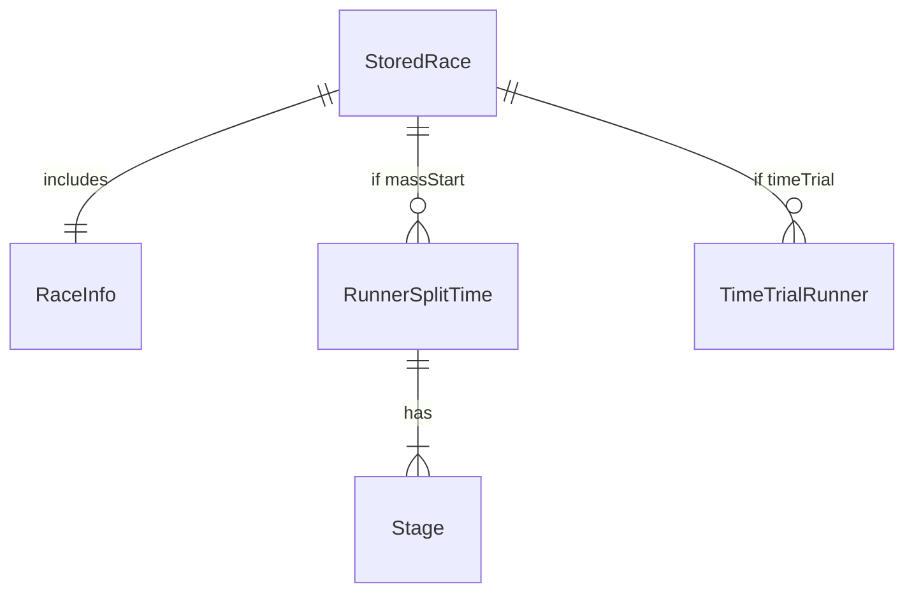

# Data model (current)

## Storage technology

**Confirmed:** Browser IndexedDB accessed through **localForage**. No SQL/migrations. No server DB.

## Logical entities

### RaceInfo

| Field | Type | Notes |
| --- | --- | --- |
| startTime | number | Epoch ms; storage key when set |
| currentTime | number | Epoch ms clock sample |
| isRunning | boolean | |
| isFinished | boolean | |
| numberOfRunners | number | |
| numberOfStages | number | Meaningful for mass start |
| raceDate | string | `toLocaleDateString()` at setup |
| raceName | string? | Optional |
| raceType | `"massStart"` \| `"timeTrial"` | |

### Stage

| Field | Type | Notes |
| --- | --- | --- |
| id | number | 1-based index |
| time | number | Duration ms; `0` = not recorded |

### RunnerSplitTime

| Field | Type | Notes |
| --- | --- | --- |
| runner | number | Bib |
| stage | Stage[] | Length = numberOfStages |

### TimeTrialRunner

| Field | Type | Notes |
| --- | --- | --- |
| runner | number | Bib |
| startTime | number | Epoch ms; 0 = not started |
| finishTime | number | Epoch ms; 0 = not finished |

### Stored race document

Key: `` `${raceInfo.startTime}` `` or `` `tt-${raceInfo.raceDate}` ``

Value:

```ts
{
  splitTimes?: RunnerSplitTime[];
  timeTrialRunners?: TimeTrialRunner[];
  raceInfo: RaceInfo;
}
```

## Relationships



## Constraints / indexes

- **Confirmed:** No DB constraints; integrity enforced only in UI logic
- **Confirmed:** No secondary indexes; `/races` scans all keys
- **Confirmed:** No schema version field — migrations not possible cleanly today

## Historical / audit data

- **Confirmed absent:** No append-only timing log, no who/when for undos, no soft deletes

## Integrity risks

1. Key collision unlikely for epoch ms keys, but TT fallback `tt-${raceDate}` can collide same-day
2. Clearing site data destroys history
3. `/admin` wipe is irreversible
4. In-progress and finished races share the same store without status filtering in the list UI beyond stored flags inside payload
5. `races.tsx` types assume `splitTimes` present when reading names — TT-only payloads still work if `raceInfo` exists

## Target direction (pointer only)

Commercial product will need a server-side, organisation-scoped model with append-oriented timing records — see [`../architecture/target-architecture.md`](../architecture/target-architecture.md) and ADR-001 / ADR-003.
