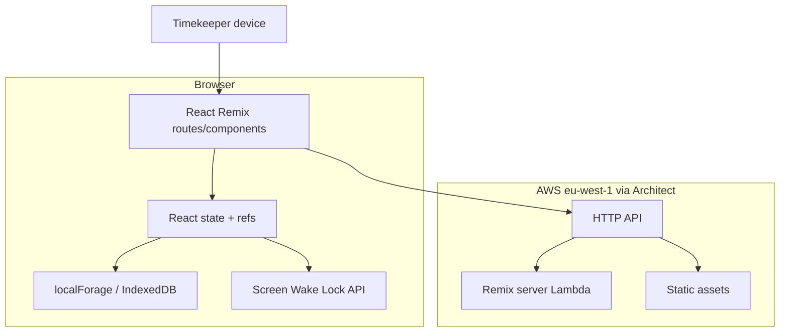

# Technical architecture (current)

**Current only.** Target architecture lives in [`../architecture/target-architecture.md`](../architecture/target-architecture.md).

## Overview

## Frontend

- **Confirmed:** Remix 2 + React 18, Tailwind, Heroicons
- **Confirmed:** Primary logic in `app/routes/_index.tsx` (large client component)
- **Confirmed:** Components under `app/components/`
- **Confirmed:** Types in `app/types.ts`; time formatting in `app/utils.ts`
- **Confirmed:** Mobile-oriented viewport (`user-scalable=0` in `entry.server.tsx`)

## Backend

- **Confirmed:** Thin Remix Architect server (`server.ts`) — request handler only
- **Confirmed:** `race.$id` loader only validates/decodes `id`; race payload loaded client-side from localForage
- **Confirmed:** No application database, queues, or background jobs

## APIs

- **Confirmed:** No first-party JSON/REST domain API for races
- **Confirmed:** App is served as HTTP `/*` catch-all (`app.arc`)

See [`api-inventory.md`](api-inventory.md).

## Authentication / authorisation

- **Confirmed absent** in application code
- **Confirmed:** `.env.example` has `SESSION_SECRET` (Remix stack leftover); unused for product auth
- **Confirmed:** `/admin` is publicly reachable

## Storage

| Store | What’s stored | Scope |
| --- | --- | --- |
| IndexedDB via localForage | Race payloads | Per browser profile / origin |
| None server-side | — | — |

## Background processing

- **Confirmed absent** (no workers). Client `setInterval` 100ms for clock UI only.

## External services / integrations

- **Confirmed:** AWS hosting via Architect
- **Confirmed absent:** Payment, email, SMS, chip timing, maps, analytics SDKs in app code

See [`integrations.md`](integrations.md).

## Deployment / CI

- **Confirmed:** GitHub Actions `.github/workflows/deploy.yml`
  - PR/push: lint, typecheck, vitest
  - `dev` branch → `arc deploy --staging --prune`
  - `main` → `arc deploy --production --prune`
- **Confirmed:** Node engines `>=20` in package.json; CI still installs Node 18 (**Partial** mismatch)
- **Confirmed:** Region `eu-west-1` in `app.arc` (README still mentions default `us-west-2` in places — documentation drift)

## Monitoring / logging

- **Confirmed:** No application-level monitoring, error tracking, or structured logging for timing operations
- **Unknown:** CloudWatch defaults from Architect/Lambda may exist in AWS account

## Security surface (summary)

See [`security.md`](security.md) and [`../gaps/security-gaps.md`](../gaps/security-gaps.md).
